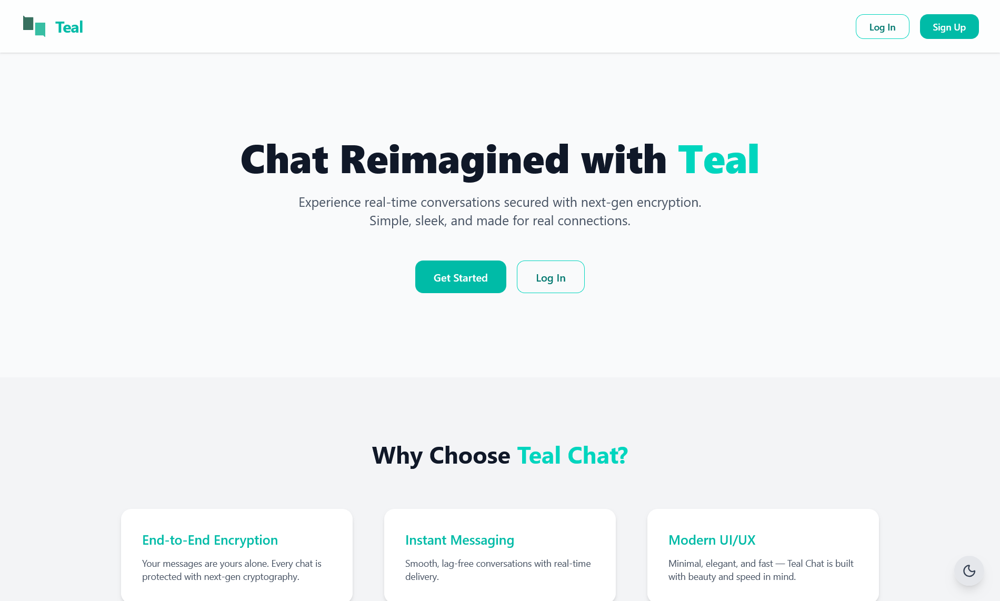
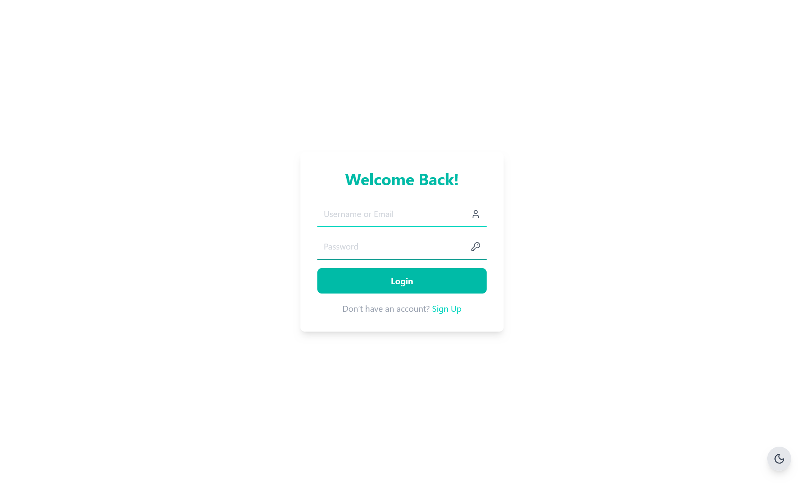
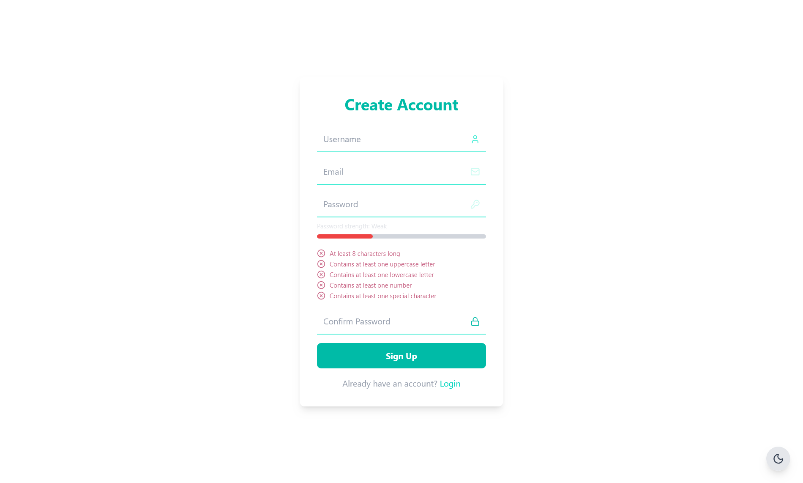
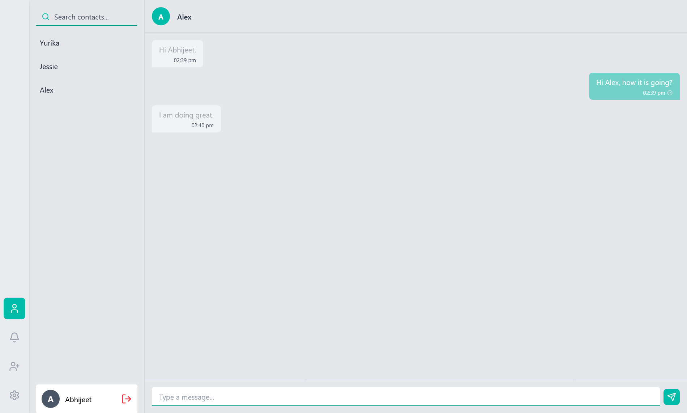
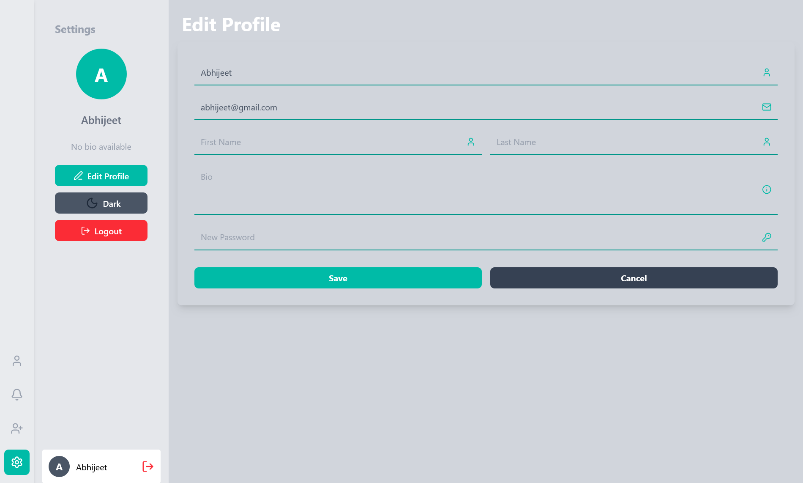

# 💬 Chat App

A modern, real-time chat application built with the **MERN Stack** and **Socket.IO**, featuring **end-to-end encrypted messaging** using **TweetNaCl**. The application provides a secure, responsive, and intuitive messaging experience with real-time communication, persistent conversations, and a modern user interface.

---

## ✨ Features

* 🔐 End-to-End Encryption (TweetNaCl)
* ⚡ Real-time messaging with Socket.IO
* 👤 User authentication using JWT
* 🔑 Secure password hashing with bcrypt
* 👥 Friend search and friend request system
* ✅ Real-time friend request notifications
* 💬 Persistent chat history
* 🌙 Dark mode support
* 🖼️ Profile management (bio, avatar, email)
* 🔍 Search users by username
* 📱 Responsive modern interface
* 🎨 Animated UI built with Framer Motion

---

## 🛠️ Tech Stack

### Frontend

* React
* Vite
* Tailwind CSS
* Framer Motion
* Axios
* Socket.IO Client

### Backend

* Node.js
* Express.js
* MongoDB
* Mongoose
* Socket.IO
* JWT Authentication
* bcrypt

### Security

* TweetNaCl
* JWT
* Password Hashing
* Environment Variables

---

## 📂 Project Structure

```
chat-app
│
├── client
│   ├── src
│   │   ├── api
│   │   ├── assets
│   │   ├── components
│   │   ├── socket
│   │   ├── context
│   │   ├── pages
│   │   ├── utils
│   │   ├── App.jsx
│   │   └── main.jsx
│   │
│   ├── package.json
│   └── .env
│
├── server
│   ├── config
│   ├── socket
│   ├── controllers
│   ├── middleware
│   ├── models
│   ├── routes
│   ├── server.js
│   ├── package.json
│   └── .env
│
└── README.md
```

---

## 🚀 Installation

### Clone the repository

```bash
git clone https://github.com/abxet/chat-app
cd chat-app
```

---

### Install dependencies

#### Backend

```bash
cd server
npm install
```

#### Frontend

```bash
cd ../client
npm install
```

---

## ⚙️ Environment Variables

### Server (`server/.env`)

```env
PORT=5000

MONGO_URI=your_mongodb_connection_string

JWT_SECRET=your_jwt_secret

CLIENT_URL=http://localhost:5173
```

---

### Client (`client/.env`)

```env
VITE_API_URL=http://localhost:5000
```

---

## ▶️ Running the Project

### Start Backend

```bash
cd server
npm run dev
```

### Start Frontend

```bash
cd client
npm run dev
```

Open your browser at:

```
http://localhost:5173
```

---

## 🔒 End-to-End Encryption

This application uses **TweetNaCl** to provide end-to-end encryption for messages.

Encryption ensures that:

* Messages are encrypted before leaving the sender's device.
* Only the intended recipient can decrypt and read the message.
* The server stores only encrypted message content and never has access to the plaintext.

This design helps protect user privacy even if the server or database is compromised.

---

## 🔄 Real-Time Communication

Socket.IO powers all real-time functionality including:

* Instant message delivery
* Online/offline status
* Friend requests
* Friend request acceptance
* Live conversation updates

---

## 📦 Main Dependencies

### Client

* React
* Vite
* Tailwind CSS
* Framer Motion
* Axios
* Socket.IO Client
* TweetNaCl

### Server

* Express
* MongoDB
* Mongoose
* Socket.IO
* JWT
* bcrypt
* dotenv
* cors

---

## 📸 Screenshots

### Home



### Login



### Signup



### Chat



### Profile



---

## 🔮 Planned Features

* Group chats
* Voice messages
* File sharing
* Image sharing
* Read receipts
* Typing indicators
* Message reactions
* Video calling
* Voice calling
* Push notifications
* Message search
* Chat backups
* Multi-device synchronization

---

## 🤝 Contributing

Contributions are welcome.

1. Fork the repository.
2. Create a feature branch.

```bash
git checkout -b feature/your-feature
```

3. Commit your changes.

```bash
git commit -m "Add new feature"
```

4. Push to your branch.

```bash
git push origin feature/your-feature
```

5. Open a Pull Request.

---

## 📄 License

This project is licensed under the MIT License.

---

## 👨‍💻 Author

Abhijeet Dewangan.
Developed with ❤️ using the MERN Stack, Socket.IO, and TweetNaCl.
